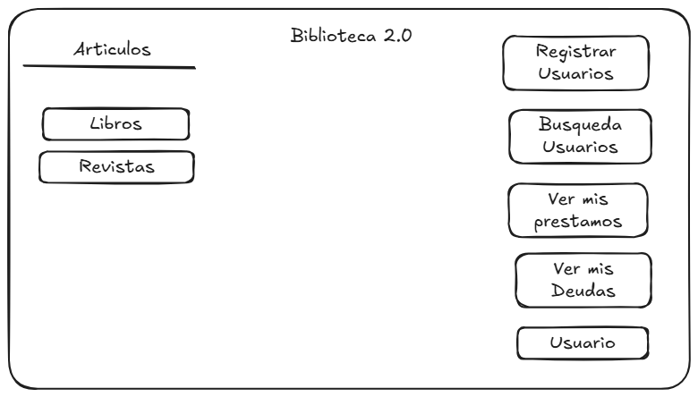
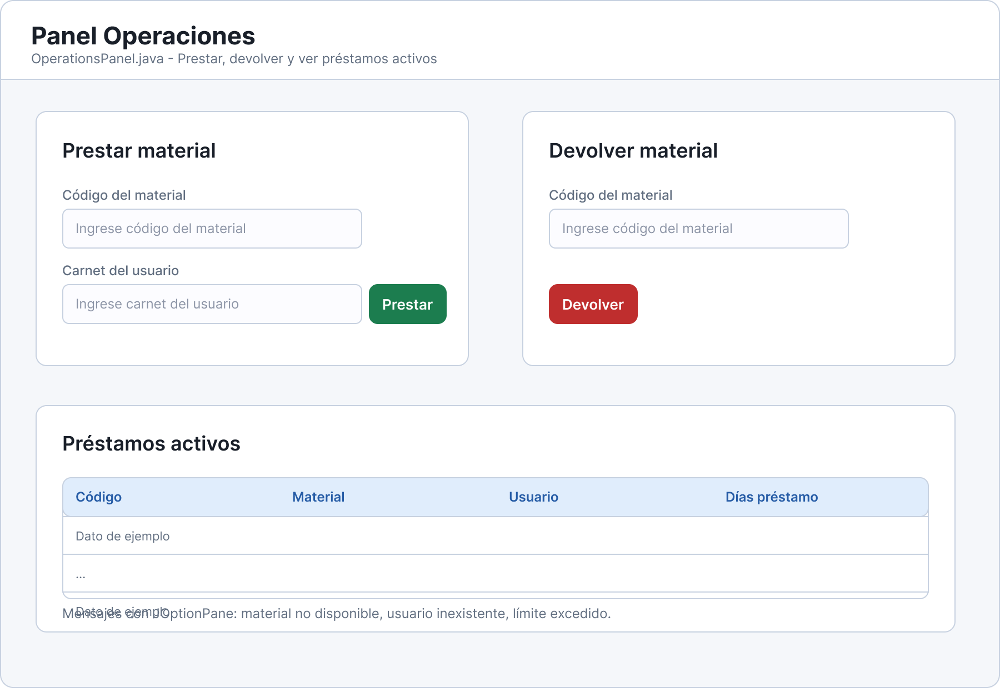
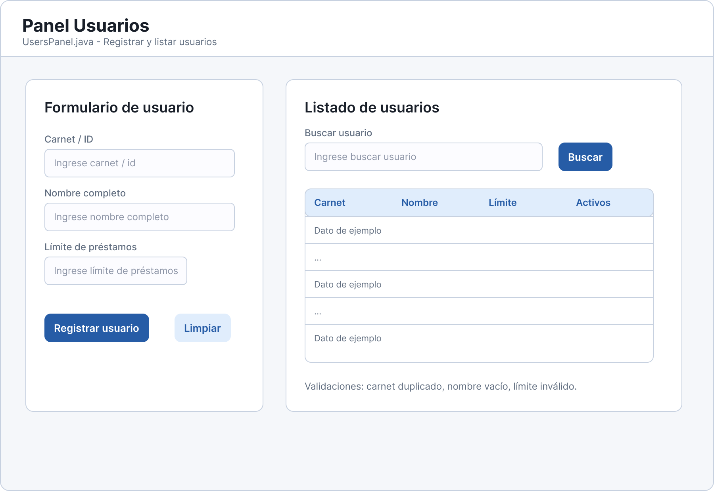
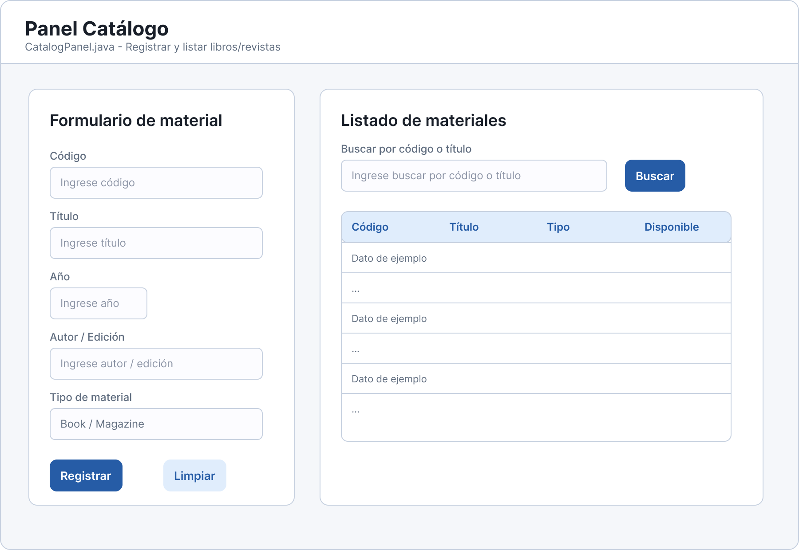

# Biblioteca 2.0

Proyecto integrador de **Programación I** desarrollado en **Java** con interfaz gráfica en **Swing**.  
La aplicación permite gestionar materiales de biblioteca, usuarios y operaciones de préstamo/devolución, aplicando conceptos de Programación Orientada a Objetos.

---

## Datos del proyecto

| Dato             | Información               |
| ---------------- | ------------------------- |
| Interfaz gráfica | Java Swing                |
| IDE Utilizado    | Eclipse IDE               |
| Opción elegida   | Opción B — Biblioteca 2.0 |
| JDK recomendado  | JDK 17 o superior         |

---

## Objetivo general

Desarrollar una aplicación de escritorio que permita administrar una biblioteca básica mediante una interfaz gráfica en Swing, aplicando correctamente encapsulamiento, herencia, polimorfismo, sobrecarga, clases abstractas y validaciones de negocio.

---

## Funcionalidades principales

- Registrar materiales de biblioteca.
- Registrar libros.
- Registrar revistas.
- Registrar usuarios.
- Listar materiales disponibles.
- Listar usuarios registrados.
- Realizar préstamos.
- Realizar devoluciones.
- Validar usuarios inexistentes.
- Validar materiales inexistentes.
- Validar materiales no disponibles.
- Validar límite máximo de préstamos por usuario.
- Consultar préstamos activos.
- Mantener el proyecto organizado por paquetes.

---

## Estructura del proyecto

```text
rc/
│
├── app/
│   └── Main.java
│
├── domain/
│   ├── Material.java
│   ├── Book.java
│   ├── Magazine.java
│   ├── User.java
│   ├── Loan.java
│   └── Library.java
│
├── ui/
│   ├── MainFrame.java
│   ├── CatalogPanel.java
│   ├── UsersPanel.java
│   └── OperationsPanel.java
│
└─── persistence/
    └── FileManager.java

```

---

## Descripción de paquetes

### `app`

Contiene la clase principal del sistema.

| Clase  | Descripción                                                                                          |
| ------ | ---------------------------------------------------------------------------------------------------- |
| `Main` | Punto de entrada de la aplicación. Crea el objeto `Library` y abre la ventana principal `MainFrame`. |

---

### `domain`

Contiene la lógica principal del proyecto y las clases del modelo.

| Clase      | Descripción                                                                  |
| ---------- | ---------------------------------------------------------------------------- |
| `Material` | Clase abstracta base para todos los materiales de biblioteca.                |
| `Book`     | Representa un libro y hereda de `Material`.                                  |
| `Magazine` | Representa una revista y hereda de `Material`.                               |
| `User`     | Representa a un usuario que puede realizar préstamos.                        |
| `Loan`     | Representa la relación entre un usuario y un material prestado.              |
| `Library`  | Clase gestora que administra materiales, usuarios, préstamos y devoluciones. |

---

### `ui`

Contiene las ventanas y paneles hechos con Swing.

| Clase             | Descripción                                                 |
| ----------------- | ----------------------------------------------------------- |
| `MainFrame`       | Ventana principal de la aplicación.                         |
| `CatalogPanel`    | Panel para registrar y listar materiales.                   |
| `UsersPanel`      | Panel para registrar y listar usuarios.                     |
| `OperationsPanel` | Panel para prestar, devolver y consultar préstamos activos. |

---

### `persistence`

Paquete reservado para la persistencia de datos.

| Clase         | Descripción                                                     |
| ------------- | --------------------------------------------------------------- |
| `FileManager` | Clase encargada de guardar y cargar información desde archivos. |

---

## Flujo de uso

### Registrar material

1. El usuario ingresa los datos en `CatalogPanel`.
2. El panel valida los campos con `ValidationUtils`.
3. Se crea un objeto `Book` o `Magazine`.
4. El panel llama a `Library.registerMaterial()`.
5. El material queda guardado en la lista de materiales.

---

### Registrar usuario

1. El usuario ingresa carnet, nombre y límite de préstamos.
2. `UsersPanel` valida que los campos no estén vacíos.
3. Se crea un objeto `User`.
4. Se llama a `Library.registerUser()`.
5. El usuario queda disponible para realizar préstamos.

---

### Prestar material

1. El usuario ingresa el carnet y el código del material.
2. `OperationsPanel` llama a `Library.loanMaterial()`.
3. `Library` busca el usuario.
4. `Library` busca el material.
5. Se valida que el usuario exista.
6. Se valida que el material exista.
7. Se valida que el material esté disponible.
8. Se valida que el usuario no supere el límite de préstamos.
9. Se crea un objeto `Loan`.
10. El material cambia a no disponible.

---

### Devolver material

1. El usuario ingresa el código del material.
2. `OperationsPanel` llama a `Library.returnMaterial()`.
3. `Library` busca el préstamo activo.
4. Se elimina o actualiza el préstamo.
5. El material vuelve a estar disponible.

---

## Validaciones principales

- No permitir campos vacíos.
- No permitir códigos de material duplicados.
- No permitir carnets de usuario duplicados.
- No permitir préstamos de materiales inexistentes.
- No permitir préstamos a usuarios inexistentes.
- No permitir prestar materiales que no estén disponibles.
- No permitir que un usuario supere su límite de préstamos.
- Mostrar mensajes de error mediante `JOptionPane`.
- Probar la lógica antes de hacer merge a `develop`.

---

## Interfaz gráfica

La interfaz está desarrollada con Java Swing.

Pantallas principales:

1. **Ventana principal**
   
   - Navegación entre módulos.

2. **Panel de catálogo**
   
   - Registro de libros y revistas.
   - Listado de materiales.
   - Búsqueda por código o título.

3. **Panel de usuarios**
   
   - Registro de usuarios.
   - Listado de usuarios.

4. **Panel de operaciones**
   
   - Préstamo de materiales.
   - Devolución de materiales.
   - Consulta de préstamos activos.

---

## Bocetos de interfaz

### Boceto inicial

Los bocetos iniciales se realizaron para planificar las pantallas antes de programarlas en Swing.



---

### Bocetos finales

Los bocetos finales se realizaron en equipo a travez de la herramienta Figma





---

## División del trabajo

### Semana 1

| Rol       | Integrante | Responsabilidad                                |
| --------- | ---------- | ---------------------------------------------- |
| Logística | Angel      | Organización, Trello y apoyo de documentación. |
| Dominio   | Eddy       | Clases principales del paquete `domain`.       |
| Swing     | Pablo      | Ventana inicial y base del paquete `ui`.       |

---

### Semana 2

| Rol         | Integrante | Responsabilidad                                       |
| ----------- | ---------- | ----------------------------------------------------- |
| Logística   | Eddy       | Seguimiento de tareas y revisión del avance.          |
| Dominio     | Pablo      | Ajustes del modelo y conexión con UI.                 |
| Swing       | Angel      | Construcción de paneles gráficos.                     |
| Repositorio | Pablo      | Integración, ramas, commits y revisión de conflictos. |

---

### Semana 3

| Rol       | Integrante | Responsabilidad                              |
| --------- | ---------- | -------------------------------------------- |
| Logística | Pablo      | Seguimiento de tareas y revisión del avance. |
| Dominio   | Angel      | Ajustes del modelo y conexión con UI.        |
| Swing     | Eddy       | Construcción de paneles gráficos.            |

---

## Integrantes

- Angel
- Eddy Daniel Guerra Melgar
- Pablo Gonzales
